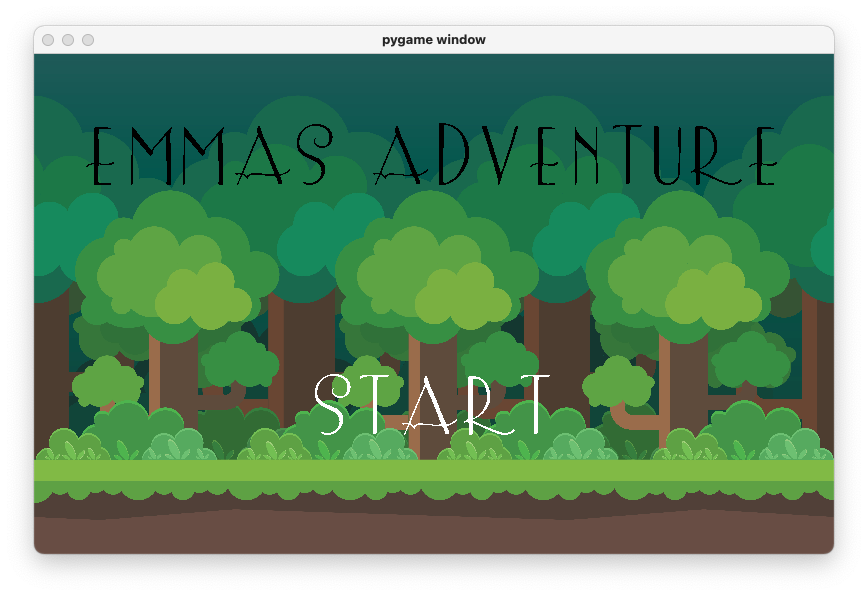
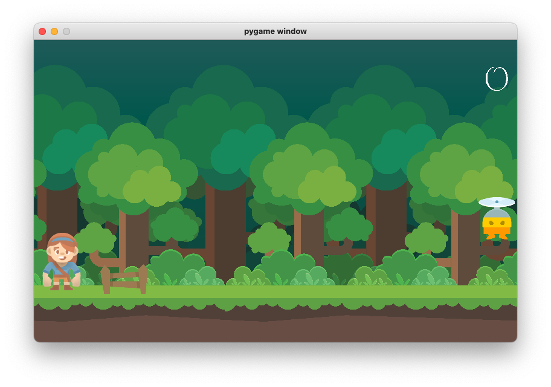
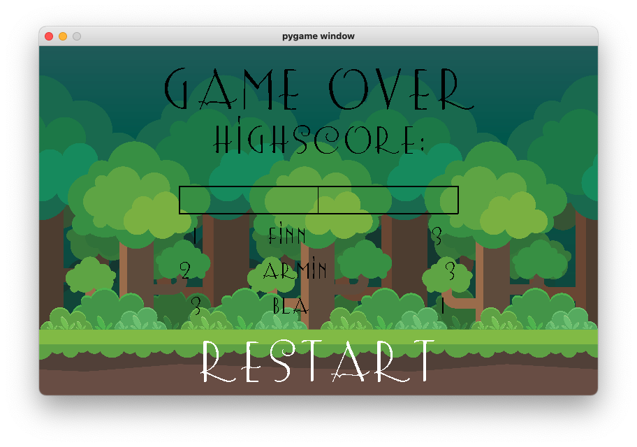

pip freeze > requirements.txt
pip install -r requirements.txt

# Python Game 
# Emmas Adventure 

Bei dem folgenden Projekt handelt es sich um ein Jump and Run Spiel, das in der Programmiersprache Python geschrieben wurde. 
Dafür wird die Bibliothek pygame genutzt. [https://www.pygame.org/news](https://www.pygame.org/news)

# Aufbau
 
Das spiel Startet mit einem Startfenster, auf dem der Spieltitel und ein Startbutton eingeblendet wird.
Wird mit der Maus auf den Startbutton geklickt, so gerät man zum Spielfenster. 

Im Spielfenster muss man die Protagonistin an Hindernissen vorbei bewegen.
Es existieren zwei Hindernisse.
Ein Zaun, der übersprungen werden muss und ein fliegenden Gegner, unter dem man sich ducken muss. 
die Steuerung erfolgt über die Pfeiltasten und dem Leerzeichen. Wird ein Hinderniss berührt, so ist das Spiel zuende. 

Ziel des Spieles ist es Münzen einzusammel, die anzahl der gesammelten Münzen wird in der rechten, oberen Ecke angezeigt. 

Verliert man das Spiel, so wird ein drittes Fenster angezeigt. Das Fenster ermöglicht es dem Nutzer seinen Namen einzugeben. 
Zusammen mit dem Namen wird die Anzahl der gesammelten Münzen in einer Datenbank gespeichert. 
Aus der Datenbank werden die Besten drei Spieler ausgelesen und auf der Seite dargestellt.

